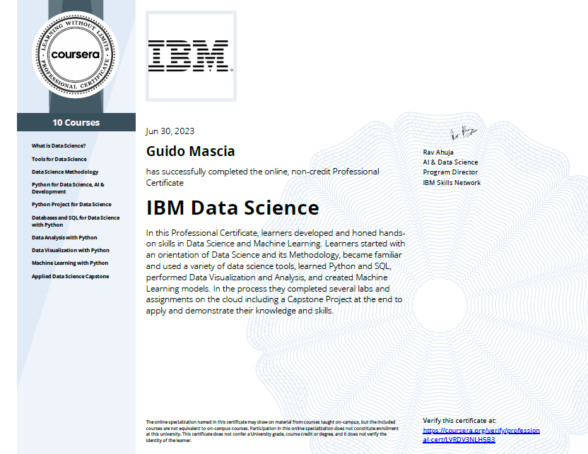

# Applied Data Science Capstone

This repository contains all the material I developed for achieving the <a href="https://www.coursera.org/professional-certificates/ibm-data-science">IBM Data Science Professional Certificate</a>.

The <code>Jupyter Notebooks</code> here provided represents a part of my *portfolio* regarding the Data Science Field.

The idea of the project is to fully deploy the skills I
acquired and that now I should master for taking part
in a Data Science project based on real data.
The most important aspects would be:

### **Hard skills**

- **Coding** using <code>Python</code> in a <code>Jupyter Notebook</code> environment, using the many Data Science libraries, such as <code>pandas</code>, <code>numpy</code>, <code>scikit-learn</code>, <code>seaborn</code>, <code>folium</code>, <code>plotly</code>, <code>dash</code>, and many more.

- **Computational thinking**, i.e., solving real world
data issues by means of coding instructions.

### **Soft skills**
- **Understanding** the patterns in the data I gathered.
- **Presenting** the data in a way that stakeholders
can be advised.

## The Data Science Project, in brief

**SpaceY** is a newly established rocket launch company which wants to compete against the already established <a href="https://www.spacex.com/">SpaceX</a>.
To do so, SpaceY should be able to:
- Reuse the 1st stage rocket booster.
- Be more cost competitive than its competitor.

SpaceX states that their launch services with 1 st stage recovery cost 62 million USD , whereas 15 million USD are required to build a 1 st stage
Falcon 9 booster when excluding R&D and profit margin.

Considering the parameters in our predictive models, a **Decision Tree** was capable to predict the successfulness of 1 st stage booster landing with an accuracy of 89%.

It comes that SpaceY will be able to predict the cost of a launch exploiting the Decision Tree model as a proxy. Thus, SpaceY will be capable of making more informed bids against SpaceX for a rocket launch.

## The Notebooks
Here you can find a brief description for each of the <code>Jupyter Notebook</code> files used for the project. All the results in the final presentation come from the above mentioned notebooks.

- <code>01_jupyter-labs-spacex-data-collection-api.ipynb</code> allows to collect launches information using the Open Source REST API for SpaceX.

- <code>02_jupyter-labs-webscraping.ipynb</code> allows to retrieve information through *web scraping* exploiting the <a href="https://en.wikipedia.org/wiki/List_of_Falcon_9_and_Falcon_Heavy_launches">Wikipedia page</a> listing the Falcon 9 Heavy launches. 

- <code>03_labs-jupyter-spacex-Data wrangling.ipynb</code> manipulates the information previously retrieved in order to get appropriate labeling for further classification model creation.

- <code>04_jupyter-labs-eda-sql-coursera_sqllite.ipynb</code> queries a SQL database to retrieve further information about the SpaceX Falcon 9 history.

- <code>05_jupyter-labs-eda-dataviz.ipynb</code> allows to perform data visualization on the data previously gathered, so that visual insights can be readiliy retrieved.

- <code>06_lab_jupyter_launch_site_location.ipynb</code> creates an interactive map to retrieve information about the Launch Sites exploited by SpaceX for the Falcon 9 missions.

- <code>07_SpaceX_Machine_Learning_Prediction_Part_5.jupyterlite.ipynb</code> trains, tune, and test different machine learning model from the previosly created dataset. 

Moreover:
- <code>spacex_dash_app.py</code> contains the **interactive dashboard**. It is intended for user friendly data exploration and visualization, i.e., for the stakeholders.

## Credits
Here it is the certificate I earned:

]

Guido Mascia, PhD. 

Email: <a href="mailto:mascia.guido@gmail.com">mascia.guido@gmail.com</a>